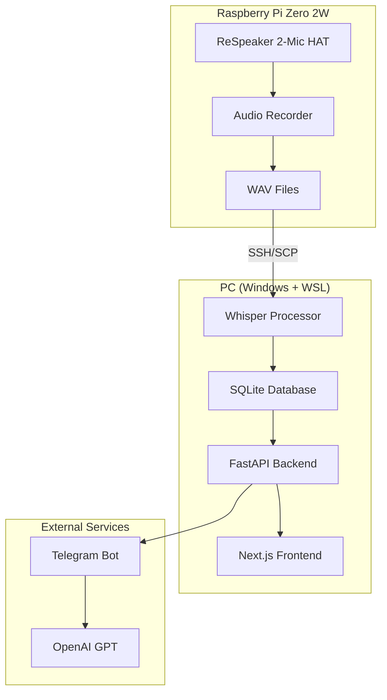

# 🎙️ AI Assistant - Personal Voice Recording and Analysis System

Автономная система для ежедневной записи и анализа речи на базе Raspberry Pi с интеграцией Whisper AI и веб-интерфейсом.

## 📋 Описание проекта

AI Assistant — это комплексное решение для:
- 📼 **Непрерывной записи аудио** на Raspberry Pi (16-18 часов в день)
- 🤖 **Автоматической расшифровки** с помощью OpenAI Whisper
- 📝 **Генерации summaries** разных уровней детализации
- 🌐 **Веб-интерфейса** для просмотра и редактирования
- 🤖 **Telegram-бота** для быстрого доступа к информации

## 🏗️ Архитектура системы



## 📁 Структура проекта

```
AI-Assistant/
├── 📁 raspberry-pi/     # Код для Raspberry Pi
├── 📁 backend/          # FastAPI backend
├── 📁 telegram-bot/     # Telegram бот
├── 📁 frontend/         # Next.js веб-интерфейс
├── 📁 libs/            # Общие библиотеки
├── 📁 tests/           # Тесты и мок-данные
├── 📁 scripts/         # Скрипты развертывания
├── 📁 docs/            # Документация
└── 📁 config/          # Конфигурационные файлы
```

## 🚀 Быстрый старт

### Требования

#### Для ПК:
- **Python 3.12+**
- **Windows 11 + WSL** или **Linux**
- **NVIDIA RTX 2060 6GB** (для Whisper)
- **Poetry** для управления зависимостями

#### Для Raspberry Pi:
- **Raspberry Pi Zero 2W**
- **ReSpeaker 2-Mic HAT**
- **PowerBank 10,000 mAh**
- **SD карта 32GB+**

### Установка

1. **Клонируйте репозиторий:**
```bash
git clone https://github.com/your-username/AI-Assistant.git
cd AI-Assistant
```

2. **Установите зависимости:**
```bash
# Установите Poetry (если не установлен)
curl -sSL https://install.python-poetry.org | python3 -

# Установите зависимости проекта
poetry install

# Для Raspberry Pi (отдельно)
poetry install --with pi
```

3. **Настройте конфигурацию:**
```bash
cp .env.example .env
# Отредактируйте .env файл под ваши настройки
```

4. **Инициализируйте базу данных:**
```bash
poetry run python -m backend.app.models.database
```

### Запуск компонентов

#### Backend (ПК):
```bash
poetry run uvicorn backend.app.main:app --reload --host 0.0.0.0 --port 8000
```

#### Frontend (ПК):
```bash
cd frontend
npm install
npm run dev
```

#### Telegram Bot:
```bash
poetry run python telegram-bot/bot.py
```

#### Raspberry Pi setup:
```bash
# Выполните на Raspberry Pi
bash scripts/setup_pi.sh
```

## 📚 Документация

- [🏗️ Архитектура системы](docs/ARCHITECTURE.md)
- [⚙️ Инструкции по настройке](docs/SETUP.md)
- [📡 API документация](docs/API.md)
- [🔧 Troubleshooting](docs/TROUBLESHOOTING.md)

## 🛠️ Разработка

### Линтинг и тестирование:
```bash
# Настройка pre-commit хуков
poetry run pre-commit install

# Запуск тестов
poetry run pytest

# Проверка типов
poetry run mypy .

# Форматирование кода
poetry run black .
poetry run isort .
```

### Ветки разработки:
- `main` - production код
- `develop` - основная ветка разработки
- `feature/*` - новые функции
- `bugfix/*` - исправления багов

## 🔐 Безопасность

- ✅ JWT авторизация (30 дней)
- ✅ SSH ключи для Pi
- ✅ Резервное копирование
- ✅ Локальный доступ к веб-интерфейсу
- ✅ Переменные окружения для секретов

## 📈 План развития

- [ ] **Этап 1**: Базовая запись и обработка аудио
- [ ] **Этап 2**: Веб-интерфейс и авторизация
- [ ] **Этап 3**: Telegram бот
- [ ] **Этап 4**: Summary система
- [ ] **Этап 5**: Спикер-диаризация
- [ ] **Этап 6**: Эмоциональный анализ
- [ ] **Этап 7**: Мультипользовательский режим

## 👥 Участники проекта

- **Арс (Старшой)** - автор идеи и разработчик
- **ChatGPT** - системный архитектор
- **Claude** - ассистент по реализации

## 📄 Лицензия

MIT License - см. [LICENSE](LICENSE) файл.

## 🤝 Вклад в проект

Мы приветствуем вклад в развитие проекта! Пожалуйста, ознакомьтесь с [CONTRIBUTING.md](CONTRIBUTING.md) для получения инструкций.

## 📞 Поддержка

Если у вас есть вопросы или проблемы:
1. Проверьте [документацию](docs/)
2. Создайте [Issue](https://github.com/your-username/AI-Assistant/issues)
3. Обратитесь в [Discussions](https://github.com/your-username/AI-Assistant/discussions)

---

**🔗 Полезные ссылки:**
- [OpenAI Whisper](https://github.com/openai/whisper)
- [FastAPI](https://fastapi.tiangolo.com/)
- [Next.js](https://nextjs.org/)
- [Raspberry Pi](https://www.raspberrypi.org/)
- [ReSpeaker HAT](https://wiki.seeedstudio.com/ReSpeaker_2_Mics_Pi_HAT/) 